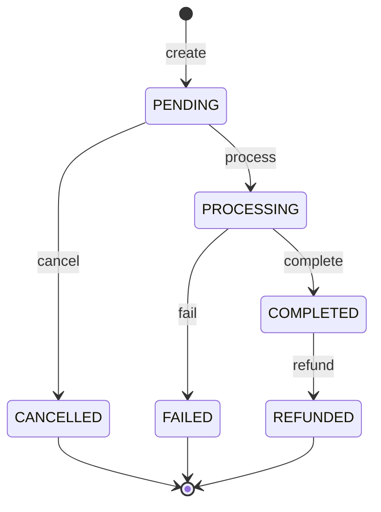

# PayFlow

PayFlow is a Java 21 / Spring Boot learning project that **simulates a payment
lifecycle**. It does not charge cards, contact a bank or payment provider, transfer
money, or issue real refunds. API calls explicitly drive each state transition.
Use synthetic data only. There is no authentication or authorization; the Compose
ports are bound to localhost for local development.

## Architecture and repository map

```text
REST client -> payment-service :8080 -> PostgreSQL (payments)
                              |      -> Redis (payment-by-id cache)
                              `------> Kafka (payment-events)
                                           |
                              audit-service :8081
                                           |
                                    PostgreSQL (audit_events)
```

| Path | Responsibility |
| --- | --- |
| `src/main/java/.../payment` | REST API, domain transitions, persistence, event publishing |
| `src/main/java/.../audit` | Embedded audit API/consumer for single-application mode |
| `src/main/resources/db/changelog` | Payment service migrations, including the shared audit table |
| `audit-service/` | Independently built application consuming Kafka events and serving audit queries |
| `src/test`, `audit-service/src/test` | Unit, MVC and PostgreSQL integration tests |
| `scripts/smoke-test.sh` | Full-stack lifecycle and audit verification |
| `.github/workflows/ci.yml` | Verification, image builds and Compose smoke test |

The root Maven project and `audit-service/pom.xml` are **separate builds**, not a
multi-module reactor. `make verify` runs both.

For this demo both services share one PostgreSQL database. Compose disables the
embedded consumer (`PAYFLOW_AUDIT_CONSUMER_ENABLED=false`) and waits for the payment
service to become healthy before starting the audit service. This ensures the
payment service creates the shared schema first. The audit migration skips table
creation if it already exists. When starting both applications outside Compose,
start the payment service first and disable its embedded consumer as well.

The standalone audit endpoint is on port 8081. The embedded endpoint on port 8080
remains present for compatibility and reads the same audit table in Compose.

## Technologies

- Java 21, Spring Boot 3.3.4, Spring MVC, Spring Data JPA and Hibernate
- PostgreSQL 17, Liquibase, Redis 7, Apache Kafka 3.8.1
- JUnit 5, Mockito, MockMvc, Testcontainers, Checkstyle, OpenAPI
- Maven Wrapper 3.9.9, Docker Compose, GitHub Actions

## Business rules

- Creating a payment starts it in `PENDING`.
- `orderId` is nonblank and at most 64 characters. It is **not unique**: separate
  payment attempts for one order are allowed.
- `amount` is between `0.01` and `99999999999999999.99`, with at most two decimal
  places, matching PostgreSQL `numeric(19,2)`. Extra decimals are rejected rather
  than silently rounded.
- `currency` is exactly three uppercase letters, e.g. `EUR`. This is a format
  check, not an ISO currency registry lookup. The demo uses two decimal places for
  every currency; currency-specific minor units and conversion are not modeled.
- `description` is optional, with a maximum of 500 characters.
- `Idempotency-Key` is required by the HTTP API, nonblank and at most 100 characters.
  Keys are case-sensitive, global to this demo and have no expiry.
- A sequential retry with the same key and identical order ID, numeric amount,
  currency and description returns the existing payment at its **current** status
  without publishing another creation event. `1` and `1.00` are equivalent;
  omitted/null description and empty description are distinct. Both creation and
  replay currently return HTTP `201`.
- Reusing a key with different request data returns `409 IDEMPOTENCY_CONFLICT`.
  A database unique constraint prevents duplicate keys, but simultaneous first
  requests are not yet guaranteed to return the same successful response.
- State changes return `200`; a forbidden transition (including repeating an
  action) returns `409 INVALID_PAYMENT_STATE`. An unknown payment returns `404`.
- Refunds are full, simulated refunds. Partial refunds and retries of failed
  payments are not supported; create a new payment attempt with a new key.
- Payment list pagination accepts `page >= 0` and `1 <= size <= 100`.

## State machine



| Action | Required state | Result |
| --- | --- | --- |
| `POST /{id}/process` | PENDING | PROCESSING |
| `POST /{id}/cancel` | PENDING | CANCELLED |
| `POST /{id}/complete` | PROCESSING | COMPLETED |
| `POST /{id}/fail` | PROCESSING | FAILED |
| `POST /{id}/refund` | COMPLETED | REFUNDED |

All paths above are relative to `/api/v1/payments`. There is no background payment
processor: the client invokes the actions explicitly.

## Run locally

Requirements: Docker with Compose v2 supporting `--wait`. For local Maven builds,
install JDK 21 and set `JAVA_HOME` to it. The wrapper downloads Maven automatically.
The smoke script also needs Bash, curl, jq and uuidgen.

```sh
cp .env.example .env
# Edit .env to choose local database credentials.
docker compose up -d --build --wait --wait-timeout 240
docker compose ps
```

- Payment API: <http://localhost:8080/api/v1/payments>
- Audit API: <http://localhost:8081/api/v1/audit-events>
- Swagger: <http://localhost:8080/swagger-ui/index.html>
- Health: <http://localhost:8080/actuator/health> and <http://localhost:8081/actuator/health>

Database credentials initialize a **new** PostgreSQL volume. Changing `.env` does
not change the password in an existing database. Do not commit `.env`.

`docker compose down` stops the stack and retains the database. Adding `-v` removes
its database volume and all demo payments. Kafka and Redis have no persistent
volumes in this demo; recreating their containers loses queued events and cache.

Optional `.env` variables `POSTGRES_PORT`, `REDIS_PORT`, `KAFKA_PORT`, `PAYMENT_PORT`
and `AUDIT_PORT` override host ports (defaults: 5432, 6379, 9092, 8080 and 8081).
Use a distinct Compose project name and unused ports to run a second stack.

If startup fails, inspect `docker compose ps` and `docker compose logs --tail=200`.
Check for occupied host ports and credentials left over in an existing volume.

## Verify locally with curl

Run this sequence in one Bash session after the stack is healthy. It requires jq.
Use the corresponding URLs if you changed host ports.

```sh
PAYMENT_URL=http://localhost:8080
AUDIT_URL=http://localhost:8081
KEY="demo-$(uuidgen)"
BODY='{"orderId":"ORD-001","amount":42.50,"currency":"EUR","description":"Demo payment"}'

# 201, PENDING. Save the ID for subsequent steps.
PAYMENT=$(curl -fsS -X POST "$PAYMENT_URL/api/v1/payments" \
  -H 'Content-Type: application/json' -H "Idempotency-Key: $KEY" -d "$BODY")
echo "$PAYMENT" | jq .
ID=$(echo "$PAYMENT" | jq -er .id)

# Same ID; still just one payment and one creation event.
curl -fsS -X POST "$PAYMENT_URL/api/v1/payments" \
  -H 'Content-Type: application/json' -H "Idempotency-Key: $KEY" -d "$BODY" \
  | jq -e --arg id "$ID" '.id == $id'

# 409: completion is forbidden while PENDING.
curl -i -X POST "$PAYMENT_URL/api/v1/payments/$ID/complete"

# Each returns 200 and the new state.
curl -fsS -X POST "$PAYMENT_URL/api/v1/payments/$ID/process" | jq .status
curl -fsS -X POST "$PAYMENT_URL/api/v1/payments/$ID/complete" | jq .status
curl -fsS -X POST "$PAYMENT_URL/api/v1/payments/$ID/refund" | jq .status
curl -fsS "$PAYMENT_URL/api/v1/payments/$ID" | jq .

# 409: the same key cannot represent a different payment request.
curl -i -X POST "$PAYMENT_URL/api/v1/payments" \
  -H 'Content-Type: application/json' -H "Idempotency-Key: $KEY" \
  -d '{"orderId":"OTHER","amount":1.00,"currency":"EUR"}'

# 400: precision exceeding two decimal places is rejected.
curl -i -X POST "$PAYMENT_URL/api/v1/payments" \
  -H 'Content-Type: application/json' -H "Idempotency-Key: invalid-$KEY" \
  -d '{"orderId":"ORD-INVALID","amount":1.001,"currency":"EUR"}'

curl -fsS "$PAYMENT_URL/api/v1/payments?page=0&size=20&status=REFUNDED" | jq .
curl -fsS "$AUDIT_URL/api/v1/audit-events/payment/$ID" | jq .
```

Audit consumption is asynchronous; the last query may initially be incomplete.
Eventually it should contain `PENDING`, `PROCESSING`, `COMPLETED`, `REFUNDED`.
For a bounded, automated check that waits for health and audit delivery:

```sh
make smoke
# With custom application ports:
PAYMENT_URL=http://localhost:18080 AUDIT_URL=http://localhost:18081 make smoke
```

The smoke test creates synthetic data, checks replay and conflicts, executes the
successful lifecycle, reads through the cache, and checks four audit events.

Audit also supports `GET /api/v1/audit-events?page=0&size=20&status=COMPLETED` and
`GET /api/v1/audit-events/payment/{id}?status=COMPLETED`. Unknown status filters
return `400` on the standalone audit service.

## Tests and CI

```sh
java -version       # JDK 21
./mvnw -version     # Confirm Maven also uses JDK 21
make verify         # Both services: all tests, packaging and Checkstyle
```

On macOS, set the installed JDK explicitly when necessary:
`export JAVA_HOME=$(/usr/libexec/java_home -v 21)`.
On Windows use `mvnw.cmd verify` and `mvnw.cmd -f audit-service/pom.xml verify`.

The PostgreSQL integration test starts a disposable Testcontainers database and
runs Liquibase plus Hibernate validation. It mocks event publishing and disables
the Redis cache/embedded consumer, so it needs Docker but no running Compose
stack. The same test also covers full application context startup. Testcontainers
1.21.4 supports the newer Docker API used by Docker 29.

CI runs both builds without excluding integration tests, builds both Docker
images, waits for a healthy Compose stack, runs the smoke test, prints logs on
failure, and removes its disposable stack. Maven tests alone do not verify Kafka
or Redis integration; the full-stack smoke test does.

Other commands: `make up`, `make down`, `make logs`, `make test`, `make build`,
`make clean`. Local `make build` packages both services without running tests;
use `make verify` before sharing changes.

## Known limitations and next steps

This is a learning implementation, not a production payment system.

1. **Atomicity and event delivery:** Kafka publishing currently starts inside the
   database transaction, without an outbox. An event can be sent before a rollback,
   or a committed payment can lack an audit event after a send failure. Add a
   transactional outbox, publisher retries and delivery tests.
2. **Concurrency:** database uniqueness prevents duplicate idempotency keys, but
   racing creation requests can still produce an error. State transitions have no
   optimistic/pessimistic lock, so concurrent commands can overwrite one another.
   Add concurrency handling and PostgreSQL integration tests for these cases.
3. **Cache consistency:** Redis errors can fail API calls. Cache updates are not
   coordinated with concurrent reads/transaction commits, and no TTL is configured.
   Add a deliberate invalidation policy and failure-mode tests.
4. **Audit ownership:** the shared database and duplicate embedded/standalone
   audit implementations simplify the demo but couple the services. Separate
   schema ownership and remove the embedded implementation in a later migration.
5. **Operational scope:** authentication, provider integration, persistent Kafka,
   dead-letter processing, reconciliation, observability and dependency upgrades
   need separate work. There is no claim of exactly-once processing or production
   readiness.
